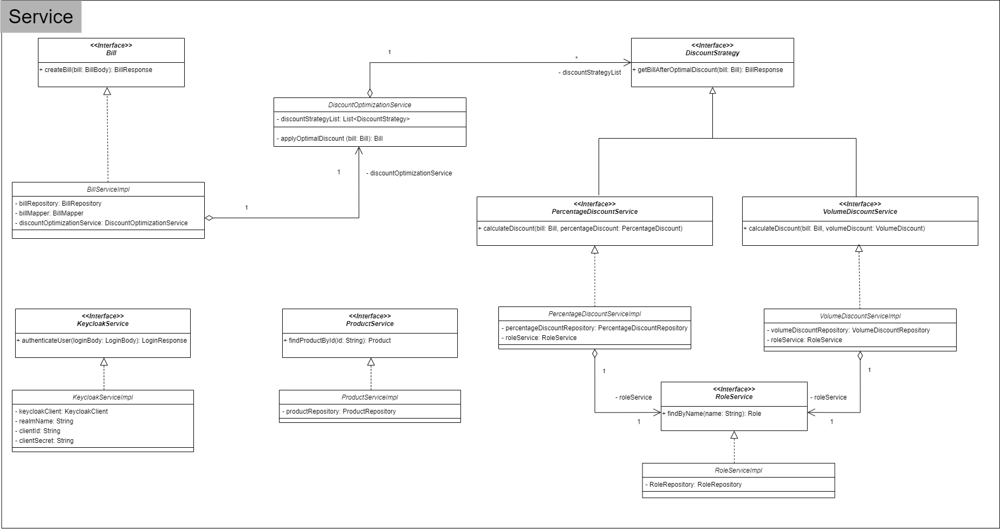

# RetailDiscountService


## Table of Contents

- [Introduction](#introduction)
- [Features](#features)
- [Tech Stack](#tech-stack)
- [Domain Layer](#domain-layer)
- [Service Layer](#service-layer)
- [How to Install and Run the Project](#how-to-install-and-run-the-project)
- [How to Run the Unit Tests](#how-to-run-the-unit-tests)
- [Discount Strategy](#discount-strategy)
- [How to Calculate Net Payable Amount](#how-to-calculate-net-payable-amount)
- [How to View API Docs](#how-to-view-api-docs)
- [Notes](#notes)

## Introduction

API acting as a discount service in a microservices setup, designed to calculate net payable amounts for retail purchases.
Discount types are percentage and volume based discounts. Each discount registered onto the system can exclude some 
item categories and user roles/types from being eligible. Furthermore, to qualify for a given discount, individuals must have 
been registered in the system for a minimum of X years, configured on the discount's eligibility criteria.

## Features

- Optimized discount calculation based on user's role, date of registration into the system, 
    price, and items' categories in the bill.
- Role-based authorization
- Authentication through Keycloak
- Persistent storage using MongoDB
- Unit testing using Mockito and JUnit
- Test code coverage with reporting
- Test results with reporting
- Documentation with Swagger

## Tech Stack

The main technologies used in this project are:

- Java - Spring Framework
- Keycloak
- MongoDB
- Mockito
- JUnit
- Docker
- Maven


## Domain Layer


## Service Layer




## How to Install and Run the Project
After checking out the git repo, assuming you have the Linux Make Utility, run the following command:
```bash
make run
```

Otherwise, you can directly use the docker-compose file
```bash
docker-compose up --build
```

## How to Run the Unit Tests

To run the unit tests only without report display
```bash
make test
```

To run the unit tests and view the results rendered on a new tab on your browser
```bash
make test-and-display-test-results
```

To run the unit tests and view the code coverage rendered on a new tab on your browser
```bash
make test-and-display-test-coverage
```


## Discount Strategy

The discount strategy employed to find the optimal discount, searches for eligible discounts 
for the user, and picks the optimal one. For more information about the algorithm and discount 
eligibility criteria, the code can be inspected.


## How to Calculate Net Payable Amount

Firstly, you need to retrieve an access token through POST /api/users. For example:
```json
{
  "username": "employee@myretailbusiness.com",
  "password": "employee"
}
```
The response will be like this:
```json
{
    "token": "eyJhbGciOiJSUzI1NiIsInR5cCIgOiAiSldUIiwia2lkIiA6ICJha1phRmtQSWxHWWhZUmlWdlFmTE81dGhKd3YzLXVJeXhvN0hUVGZaTW1ZIn0.eyJleHAiOjE3MTEyNDYzMjgsImlhdCI6MTcxMTI0NjAyOCwianRpIjoiNGUwYjM5ODQtNTgwZi00MjFmLWJmNzEtOWMyZGFlZDYxNGY2IiwiaXNzIjoiaHR0cDovL2tleWNsb2FrOjgwODAvcmVhbG1zL215cmV0YWlsYnVzaW5lc3MiLCJhdWQiOlsiYmlsbGluZy1zZXJ2aWNlIiwiYWNjb3VudCJdLCJzdWIiOiJhM2VmODYxZS1mZjJmLTQ4NTctOTIxNy1hZTBlNWY1MzM3ODIiLCJ0eXAiOiJCZWFyZXIiLCJhenAiOiJiaWxsaW5nLXNlcnZpY2UiLCJzZXNzaW9uX3N0YXRlIjoiZDc1OTgxNDEtYTZiMC00ZTA1LThmOTctOWE5NGYyZWVhNmI0IiwiYWNyIjoiMSIsImFsbG93ZWQtb3JpZ2lucyI6WyIvKiJdLCJyZWFsbV9hY2Nlc3MiOnsicm9sZXMiOlsiZGVmYXVsdC1yb2xlcy1teXJldGFpbGJ1c2luZXNzIiwiRU1QTE9ZRUUiLCJvZmZsaW5lX2FjY2VzcyIsInVtYV9hdXRob3JpemF0aW9uIl19LCJyZXNvdXJjZV9hY2Nlc3MiOnsiYWNjb3VudCI6eyJyb2xlcyI6WyJtYW5hZ2UtYWNjb3VudCIsIm1hbmFnZS1hY2NvdW50LWxpbmtzIiwidmlldy1wcm9maWxlIl19fSwic2NvcGUiOiJwcm9maWxlIGVtYWlsIiwic2lkIjoiZDc1OTgxNDEtYTZiMC00ZTA1LThmOTctOWE5NGYyZWVhNmI0IiwiY3JlYXRlZEF0IjoxNjg1MDk0MjcwLCJlbWFpbF92ZXJpZmllZCI6dHJ1ZSwibmFtZSI6ImVtcGxveWVlIGVtcGxveWVlIiwicHJlZmVycmVkX3VzZXJuYW1lIjoiZW1wbG95ZWVAbXlyZXRhaWxidXNpbmVzcy5jb20iLCJnaXZlbl9uYW1lIjoiZW1wbG95ZWUiLCJmYW1pbHlfbmFtZSI6ImVtcGxveWVlIiwiZW1haWwiOiJlbXBsb3llZUBteXJldGFpbGJ1c2luZXNzLmNvbSJ9.cy4XBRaZgjZQTkBHHt0xzfNCEMqO-AKi37tt1S_z1BvP3fZo8djteJ-EtX2_WAK8BkOf-4WoBYmf18VyZNzZEv24htCJnnBFnYLVLlbmaS8WGwC-00tZAxejqZYN1BLA7KrQCLdsstrq7feFiMxbgWjJ8Zgz4oceggc9FbWXkSfAjoFHCZIHlA5jEprWZ1XRakp-mZunmlasjxL6Ye2iLuFY6Oal8MtZQoM-IwiYe8VLaqIuTPdz5sefRWoDaFwOip9Rr7-4OZfe5JS1G6FaGY7n32Hct8zxafKyPJfySShFPzzDKzM5uE7a0fGPXvVfwjvy6ttdNTWYPUpJLCmF3g",
    "expiresInSeconds": 300
}
```

You can decode the access token and view its content. The two most important things are the user's roles and registration
unix epoch (createdAt claim), because they are used in the discount strategy.

After you retrieve the access, you can pass the bill details through POST /api/billings, to calculate 
your net payable amount. For example:
```json
{
  "billItemList": [
    {
      "productId": "65ff8ac791811f31ecf46a0d",
      "quantity": 3
    },
    {
      "productId": "65ff8ac791811f31ecf46a10",
      "quantity": 2
    }
  ]
}
```
The response should be like this:
```json
{
    "id": "65ff8b7c91811f31ecf46a17",
    "createdDate": "2024-03-24T02:10:04.989127104",
    "lastModifiedDate": "2024-03-24T02:10:04.989127104",
    "createdByUser": "employee@myretailbusiness.com",
    "modifiedByUser": "employee@myretailbusiness.com",
    "totalBeforeDiscount": 456.90285001144696,
    "totalAfterDiscount": 319.8319950080129,
    "discountType": "PERCENTAGE_DISCOUNT",
    "discountDescription": "employees 30% discount, excluding groceries",
    "discountRate": 0.3,
    "discountAmount": 137.07085500343408
}
```

## How to View API Docs
To view the API docs by Swagger, open `http://localhost:8080/swagger-ui/index.html`

## Notes

- The default Spring profile used in the app is local. This profile is used to register beans that provide help in local development. 
   For example, there's a bean whose responsibility is to create some data on the database at post construct. Please open mongo express at
   `http://localhost:8081/db/discount-service` with `local` username and password to find the collections that are created when the local 
    profile is active. 
- An already configured Keycloak realm is mounted onto the Keycloak container's file system. The realm hosts 3 users and 3 realm roles:

    |            Username            | Password  |   Role    |
    |:------------------------------:|:---------:|:---------:|
    | employee@myretailbusiness.com  | employee  | EMPLOYEE  |
    | affiliate@myretailbusiness.com | affiliate | AFFILIATE |
    | customer@myretailbusiness.com  | customer  | CUSTOMER  |
- The OAuth 2.0 flow used is Password Grant Type. Although this flow is insecure and will be omitted from OAuth2.1 specs, 
    the flow has been used for the sake of simplicity.
- An already configured Keycloak client is imported on the realm with direct access allowed. This client is for the backend application, to be able 
    to authenticate users using their credentials. To view the realm's config, please use `local` username and password 
    in the admin login console.
- UML Class diagrams can be found in the original format (draw.io) at [this directory](uml/)
- Sonarqube analysis results can be found at [this directory](sonarqube/)
